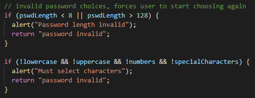
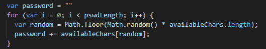
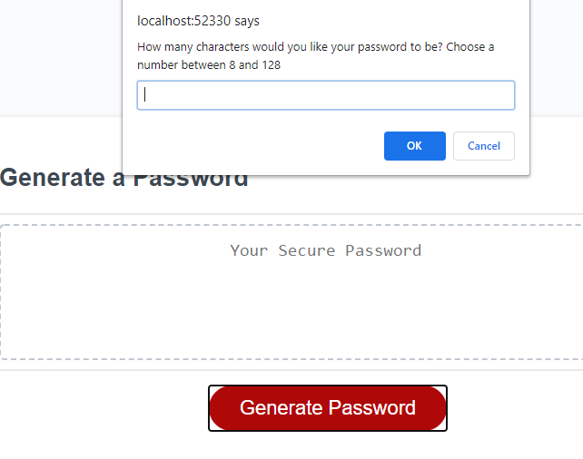
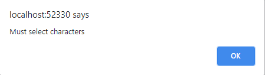
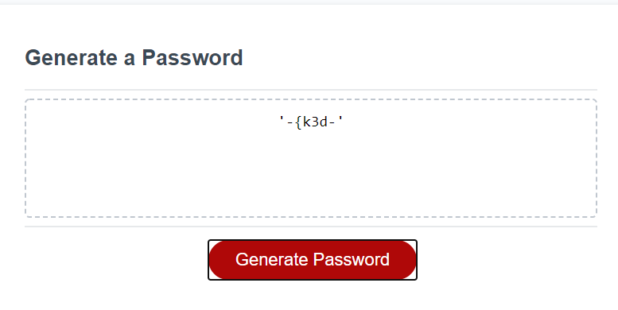

# password-generator

## About This Project

The goal for this assignment was to creat a random password generator that obeyed the criteria that the user selects for their password. To view this project [click here!](https://silvia-taliana.github.io/password-generator/)

For this assignment, a variety of coding techniques in javascript were used to create the password generator, while the html and css file were already provided. The javascript techniques required were strings, booleans, loops, if/then statements, alerts, event listeners, query selectors, random number generators and callback functions.

## Installation

First of all, the query selectors were created so the correct sections of the html file could be manipulated. For example, the id "generate" on the button element had to be selected so it could then be given a function. However, in order for the computer to know that it needs to do something when the user clicked the button, it needed have an event listener so the computer reacts to the click on that specific button. 

When the event listener registeres the click, it starts running the function called write password. This is one of two callback functions. This particular function sets the password value to text so that the computer knows what to expect in return. Then it runs the following callback function called generate password. 

Within the generate password function, there are a few different elements designed to help the user choose the criteria for their password. A prompt is used to ask the user how long they would like their password to be. This is followed by the booleans, which are questions with only a yes (true) or no (false) answer, and they ask the user about whether or not they would like to include lowercase letters, uppercase letters, numbers or special characters in their password. 

For the password generator to work properly, there needed to be a fallback if the user did not choose a password length between 8-128 characters or if they did not choose any criteria for their password. If/then statements were used in these situations so IF the criteria was not selected appropriately, THEN an alert would appear to tell the user that their password was invalid and also return the user back to the beginning to choose again. 

 

A variable called "availableChars" was then created with an empty string. This was important because as each different criteria was selected, the available characters within that string (e.g. numbers = "0123456789") would then be added on to the end of the availableChars string creating one long string with all the chosen characters. 

Then another variable with an empty string called password was created. This was important because the availableChars string needed to be run through a random number generator so that the password string created was made up out of all the avaliable characters previously selected. This was done using the following for loop. 

 

The for loop basically tells the computer that variable i = 0, and providing variable i is less than the length of the password chosen by the user, then the computer needs to run the random number generator. This generates a character randomly chosen out of the availableChars string and puts that character on the end of the password string. Then the computer adds 1 to the variable i. This loop only stops when the variable i is no longer less than the password length chosen by the user. Once it reaches this point, the password string is then returned to the function it is in, and this returns the password to the screen where the user can see it. 

## Usage 

This shows how when the user clicks on the generate password button, the prompts appear: 

 

Alerts such as the following appear if there is no criteria selected: 

 

Finally, when the all criteria is selected, the password appears (example is based on choosing 8 characters with only lower case letters, numbers and special characters):

 

## License

Creative Commons Attribution 4.0 International Public License 

MIT License